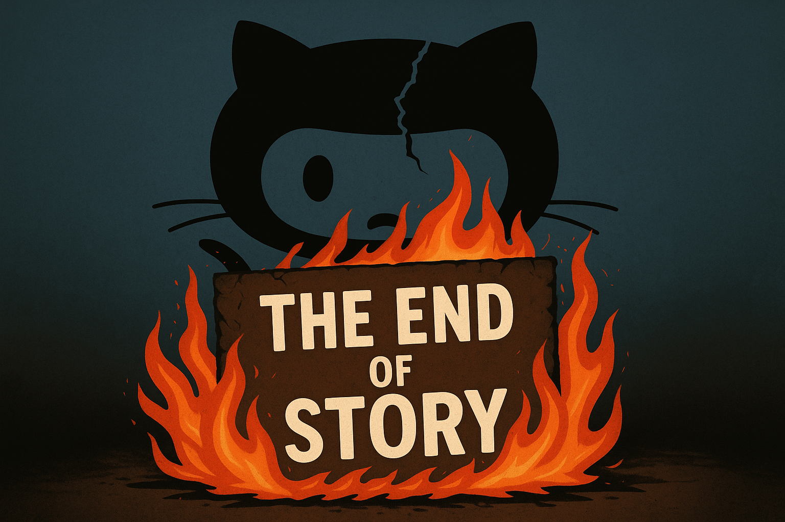

<

  

<!-- ================= IDENTITY ================= -->

---

<!-- ================= ABOUT ME ================= -->

---

<!-- ================= ENGINEERING JOURNEY (RARE) ================= -->

---

<!-- ================= DOMAINS ================= -->

---

<!-- ================= HOW I THINK (VERY RARE) ================= -->

---

<!-- ================= TECH STACK ================= -->

---

<!-- ================= GITHUB OVERVIEW (TOP 1% STYLE) ================= -->

  

## 🎧 Focus & Philosophy

  

  <i>Bhagavad Gita • Discipline • Clarity • Focus Mode</i>

  <i>Bhagavad Gita • Telugu Discourses • Chaganti Koteswara Rao</i>

---

<!-- ================= CURRENTLY EXPLORING (RARE) ================= -->

---

<!-- ================= CONNECT ================= -->

---

---

---

  

